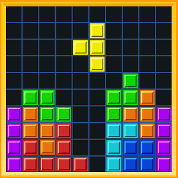

# Tetris Game
<!-- Improved compatibility of Back to Top link: See: https://github.com/othneildrew/Best-README-Template/pull/73 -->
<a name="readme-top"></a>
<!--


<!-- PROJECT SHIELDS -->
<!--
-->
[![TheDanielTp][contributors-shield]][contributors-url]
[![Forks][forks-shield]][forks-url]
[![Stargazers][stars-shield]][stars-url]
[![Issues][issues-shield]][issues-url]
[![MIT License][license-shield]][license-url]
[![LinkedIn][linkedin-shield]][linkedin-url]


<!-- PROJECT LOGO -->
<br />
<div align="center">
  <a href="https://github.com/TheDanielTp/Tetris">
    
  </a>
<h3 align="center">Tetris Game</h3>

  <p align="center">
    🎮 Fully featured terminal version of the game "Tetris" written in C++ 🎮
    <br />
  </p>
</div>


<!-- TABLE OF CONTENTS -->
<details>
  <summary>Table of Contents</summary>
  <ol>
    <li>
      <a href="#about-the-project">About The Project</a>
      <ul>
        <li><a href="#built-with">Built With</a></li>
      </ul>
    </li>
    <li>
      <a href="#getting-started">Getting Started</a>
      <ul>
        <li><a href="#installation">Installation</a></li>
      </ul>
    </li>
    <li><a href="#gameplay">Gameplay</a></li>
    <li><a href="#contributing">Contributing</a></li>
    <li><a href="#license">License</a></li>
    <li><a href="#contact">Contact</a></li>
  </ol>
</details>


<!-- ABOUT THE PROJECT -->
## 🔴 About The Project

This is an open-source Tetris game made using c++ for my mid-term project. Feel free to use the source code and edit it however you want.

### Built With 

* [![CPP][CPP.image]][CPP-url]

<p align="right">(<a href="#readme-top">Back to Top</a>)</p>


<!-- GETTING STARTED -->
## 🟠 Getting Started

Feel free to download the source code of the project and run it via your own compiler. You can also download the .exe file and run it to play the game via your own terminal. And don't forget to contribute if you have any ideas on how to make the game better.


### Installation

1. Download the source code from [Here](https://github.com/TheDanielTp/Tetris/archive/refs/heads/main.zip)
2. Use your preferred compiler to compile the code. If you're using windows cmd, use the following command.
   ```sh
   gcc Tetris.cpp -o Tetris.exe
   ```
3. To run the game, simply open the .exe file created. If you're using windows cmd, use the following command.
   ```sh
   Tetris.exe
   ```
4. Enjoy the Game.

<p align="right">(<a href="#readme-top">Back to Top</a>)</p>


<!-- USAGE EXAMPLES -->
## 🟡 Gameplay

1. Run the game as instructed above using terminal or by double clicking the .exe file.
2. In the main menu, use any key to start a new game.
   - Use '2' key to open the leaderboard, and '3' key to exit the game.
3. In the themes menu, choose your preferred theme using the instructed keys.
   - Use any key to choose the default theme. Use '2' key for Blue-Green theme and '3' key for Orange-Red theme.
4. Enter your name
5. Use WASD or Arrow keys to move the numbers in the directions.
6. The Goal is to merge numbers until you reach Tetris.
   - You can still continue to play the game after reaching Tetris.

_For more instructions to play, please refer to [this link](https://www.wikihow.com/Beat-Tetris)_

<p align="right">(<a href="#readme-top">Back to Top</a>)</p>


<!-- CONTRIBUTING -->
## 🟢 Contributing

Contributions are what make the open source community such an amazing place to learn, inspire, and create. Any contributions you make are **greatly appreciated**.

If you have a suggestion that would make this better, please fork the repo and create a pull request. You can also simply open an issue with the tag "enhancement".
Don't forget to give the project a star! Thanks again!

1. Fork the Project
2. Create your Feature Branch (`git checkout -b feature/AmazingFeature`)
3. Commit your Changes (`git commit -m 'Add some AmazingFeature'`)
4. Push to the Branch (`git push origin feature/AmazingFeature`)
5. Open a Pull Request

<p align="right">(<a href="#readme-top">Back to Top</a>)</p>


<!-- LICENSE -->
## 🔵 License

Distributed under the MIT License. See `LICENSE.txt` for more information.

<p align="right">(<a href="#readme-top">Back to Top</a>)</p>


<!-- CONTACT -->
## 🟣 Contact

My Email - prof.danial4@gmail.com

Project Link: [https://github.com/TheDanielTp/Tetris](https://github.com/TheDanielTp/Tetris)

<p align="right">(<a href="#readme-top">Back to Top</a>)</p>


<!-- MARKDOWN LINKS & IMAGES -->
<!-- https://www.markdownguide.org/basic-syntax/#reference-style-links -->
[contributors-shield]: https://img.shields.io/github/contributors/TheDanielTp/Tetris.svg?style=for-the-badge
[contributors-url]: https://github.com/TheDanielTp/Tetris/graphs/contributors
[CPP-url]: https://cplusplus.com/
[CPP.image]: https://img.shields.io/badge/-C++-blue?logo=cplusplus
[forks-shield]: https://img.shields.io/github/forks/TheDanielTp/Tetris.svg?style=for-the-badge
[forks-url]: https://github.com/TheDanielTp/Tetris/network/members
[stars-shield]: https://img.shields.io/github/stars/TheDanielTp/Tetris.svg?style=for-the-badge
[stars-url]: https://github.com/TheDanielTp/Tetris/stargazers
[issues-shield]: https://img.shields.io/github/issues/TheDanielTp/Tetris.svg?style=for-the-badge
[issues-url]: https://github.com/TheDanielTp/Tetris/issues
[license-shield]: https://img.shields.io/github/license/TheDanielTp/Tetris.svg?style=for-the-badge
[license-url]: https://github.com/TheDanielTp/Tetris/blob/master/LICENSE.txt
[linkedin-shield]: https://img.shields.io/badge/-LinkedIn-black.svg?style=for-the-badge&logo=linkedin&colorB=555
[linkedin-url]: https://linkedin.com/in/linkedin_username
[product-screenshot]: images/screenshot.png
[Next.js]: https://img.shields.io/badge/next.js-000000?style=for-the-badge&logo=nextdotjs&logoColor=white
[Next-url]: https://nextjs.org/
[React.js]: https://img.shields.io/badge/React-20232A?style=for-the-badge&logo=react&logoColor=61DAFB
[React-url]: https://reactjs.org/
[Vue.js]: https://img.shields.io/badge/Vue.js-35495E?style=for-the-badge&logo=vuedotjs&logoColor=4FC08D
[Vue-url]: https://vuejs.org/
[Angular.io]: https://img.shields.io/badge/Angular-DD0031?style=for-the-badge&logo=angular&logoColor=white
[Angular-url]: https://angular.io/
[Svelte.dev]: https://img.shields.io/badge/Svelte-4A4A55?style=for-the-badge&logo=svelte&logoColor=FF3E00
[Svelte-url]: https://svelte.dev/
[Laravel.com]: https://img.shields.io/badge/Laravel-FF2D20?style=for-the-badge&logo=laravel&logoColor=white
[Laravel-url]: https://laravel.com
[Bootstrap.com]: https://img.shields.io/badge/Bootstrap-563D7C?style=for-the-badge&logo=bootstrap&logoColor=white
[Bootstrap-url]: https://getbootstrap.com
[JQuery.com]: https://img.shields.io/badge/jQuery-0769AD?style=for-the-badge&logo=jquery&logoColor=white
[JQuery-url]: https://jquery.com 
